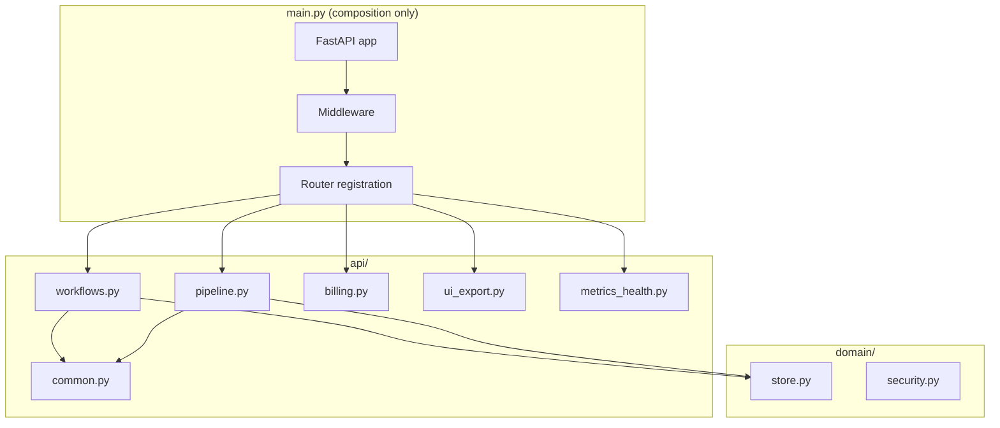

# [1/8] Orchestrator extraction — split main.py into api/ and domain/ modules

## 🎯 Layer 1: Intent Parsing

**Task Title:** services/orchestrator: extract api/common, api/workflows, api/pipeline, api/billing, api/ui_export, api/metrics_health, domain/store, domain/security

**Primary Goal:** Remove god-service ownership from main.py (3475 lines). Split workflow CRUD, pipeline, billing, UI export, metrics, and domain logic into dedicated modules. main.py becomes app composition only.

**User Story / Context:** As a maintainer, I want the orchestrator split into clear modules so that each route family has a single owner, boundaries are enforced, and the codebase is maintainable at scale.

**Business Impact:** Enables parallel development, clearer ownership, and CI boundary checks. Required for full-plan completion per audit.

**Task Metadata:**
- **Sprint**: Sprint 3
- **Milestone**: Phase 1 – Sprint 3 (Mar 3–16)
- **Related Epic/Project**: GitHub Project 9, Full-completion implementation outline
- **Issue Type**: Feature
- **Area**: orchestration
- **Chain**: N/A
- **Preset**: N/A
- **Labels**: area:orchestration, phase:foundation, type:feature

**Project Board (Required):** GitHub Project 9

**Contributor Action:** Fill in all metadata; ensure goal is clear and measurable.

---

## 📚 Layer 2: Knowledge Retrieval

**Required Skills / Knowledge:**
- [ ] FastAPI, Python module structure
- [ ] LangGraph workflow orchestration
- [ ] Review patterns in `.cursor/skills/`

**Estimated Effort:** M (3-5 days)

**Knowledge Resources:**
- [ ] Review `docs/internal/boundaries.md`
- [ ] Read `services/orchestrator/main.py` structure
- [ ] Check `.cursor/llm/docs/` for API patterns
- [ ] Read Product spec: `docs/planning/0-Master-Index.md`
- [ ] Study tech docs / ADRs in `docs/adrs/`

**Architecture Context:**

**System Architecture Diagram:**



**Code Examples & Patterns:**

Current route pattern in `main.py` (to migrate):

```python
# services/orchestrator/main.py (lines 527-530)
@app.post("/api/v1/workflows/generate")
def workflows_generate(
    body: CreateWorkflowBody,
    ...
```

Target structure after extraction:

```python
# api/workflows.py
from fastapi import APIRouter
router = APIRouter(prefix="/api/v1/workflows", tags=["workflows"])

@router.post("/generate")
def workflows_generate(body: CreateWorkflowBody, ...): ...
```

```python
# main.py (composition only)
from api.workflows import router as workflows_router
app.include_router(workflows_router)
```

**Contributor Action:** Check off resources as used; document patterns discovered.

---

## ⚠️ Layer 3: Constraint Analysis

**Known Dependencies:**
- [ ] None; first in sequence

**Technical Constraints:**
- Route signatures must remain unchanged (no behavior regression)
- Orchestrator cannot import from apps/studio or apps/api-gateway (CI rule)
- Performance: no regression in request latency
- Security: ownership checks preserved

**Current Blockers:** None identified

**Risk Assessment & Mitigations:**
- Risk: Large refactor may introduce regressions. Mitigation: Integration tests unchanged; route list before/after must match.
- Risk: Circular imports. Mitigation: domain/ has no api imports; api/ imports domain.

**Resource Constraints:**
- **Deadline**: TBD
- **Effort Estimate**: M

---

## 💡 Layer 4: Solution Generation

**Solution Approach:**
- Create `api/workflows.py`, `api/pipeline.py`, `api/billing.py`, `api/ui_export.py`, `api/metrics_health.py`
- Create `domain/store.py`, `domain/security.py`. Extract `get_caller_id`, `assert_workflow_owner` into `api/common.py`
- main.py: middleware, startup, router mounting only

**Design Considerations:**
- [ ] Follow established patterns from `.cursor/skills/`
- [ ] Maintain consistency with existing codebase
- [ ] Consider scalability and maintainability
- [ ] Ensure proper error handling
- [ ] Plan for testing and validation
- [ ] Consider security implications

**Acceptance Criteria (Solution Validation):**
- [ ] main.py is thin composition file (<200 lines of business logic)
- [ ] All route families imported from new modules
- [ ] Route list before/after matches exactly
- [ ] Integration tests pass
- [ ] No imports from apps/studio or apps/api-gateway in orchestrator

---

## 📋 Layer 5: Execution Planning

**Implementation Steps:**
1. [ ] Create api/common.py with get_caller_id, assert_workflow_owner
2. [ ] Create api/workflows.py; move workflow CRUD, list/get, run history, streaming
3. [ ] Create api/pipeline.py; move generate/resume/checkpoint
4. [ ] Create api/billing.py; move credits, payments, spending controls
5. [ ] Create api/ui_export.py; move ZIP export, UI scaffold
6. [ ] Create api/metrics_health.py; move health, metrics, config, integrations-debug
7. [ ] Create domain/store.py, domain/security.py
8. [ ] Refactor main.py to composition only
9. [ ] Add docs/internal/boundaries.md; CI rule

**Environment Setup:**
**Repos / Services:** `hyperagent/services/orchestrator/`

**Required Environment Variables:**
- `SUPABASE_URL`: (get from `.env.example`)
- `REDIS_URL`: (get from `.env.example`)
- See `.env.example` for all available environment variables

---

## ✅ Layer 6: Output Formatting & Validation

**Ownership & Collaboration:**
- **Owner**: @JustineDevs
- **Reviewer**: TBD
- **Access Request**: @JustineDevs or @ArhonJay
- **Deadline**: TBD
- **Communication**: GitHub issue comments; daily stand-up updates

**Quality Gates:**
- [ ] Code follows project style guide (see `.cursor/rules/rules.mdc`)
- [ ] Integration tests pass
- [ ] No behavior regression
- [ ] Follows production standards (see `.cursor/rules/production.mdc`)
- [ ] Meets all acceptance criteria from Layer 4
- [ ] Documentation updated (boundaries.md)

**Review Checklist:**
- [ ] Code review approved
- [ ] CI/CD pipeline passes (GitHub Actions)
- [ ] No breaking changes

**Delivery Status:**
- **Initial Status**: To Do
- **Progress Tracking**: To Do → In Progress → In Review → Done
- **PR Link**: Implement in `feature/justinedevs`; open PR to `development` (per /branch guide)
