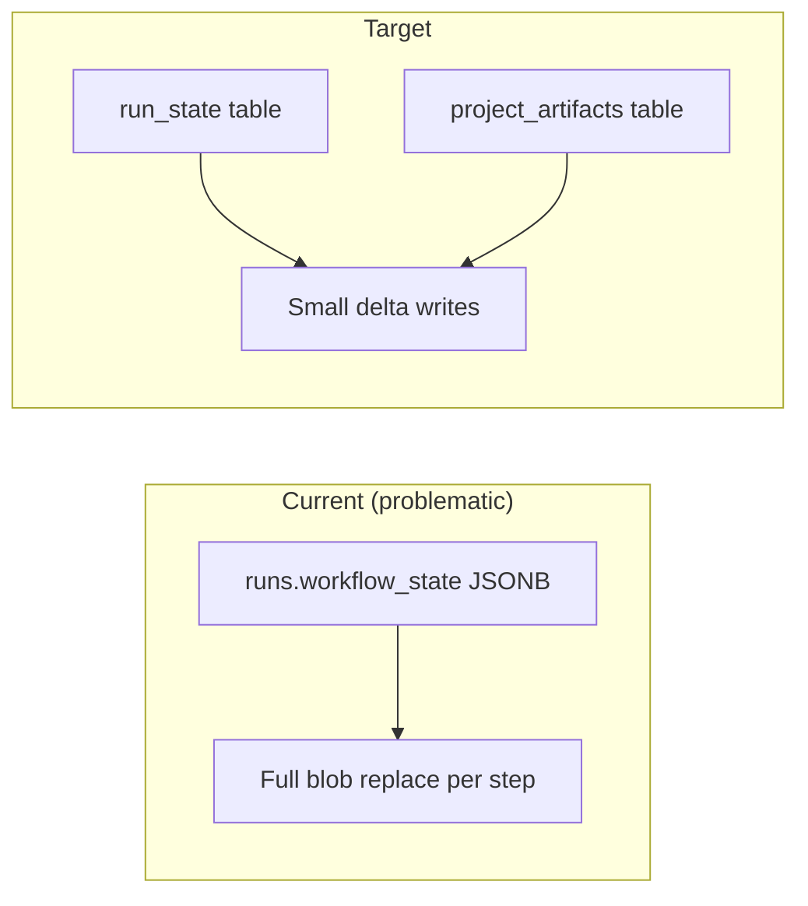

# [2/8] State and persistence rewrite — run_state + project_artifacts

## 🎯 Layer 1: Intent Parsing

**Task Title:** services/orchestrator, supabase: add run_state and project_artifacts persistence

**Primary Goal:** Replace monolithic `runs.workflow_state` JSONB with normalized `run_state` table and typed `project_artifacts` rows. Stop full-blob writes on each step.

**User Story / Context:** As a system, I want step outputs stored as typed artifacts and small run_state updates so that scale and truncation issues are eliminated.

**Business Impact:** Required for pipeline scale; eliminates silent truncation; enables artifact querying.

**Task Metadata:**
- **Sprint**: Sprint 3
- **Milestone**: Phase 1 – Sprint 3 (Mar 3–16)
- **Related Epic/Project**: GitHub Project 9
- **Issue Type**: Feature
- **Area**: orchestration
- **Chain**: N/A
- **Preset**: N/A
- **Labels**: area:orchestration, type:feature, enhancement

**Project Board (Required):** GitHub Project 9

---

## 📚 Layer 2: Knowledge Retrieval

**Required Skills / Knowledge:**
- [ ] Supabase/PostgreSQL, Python persistence
- [ ] Migrations, RLS

**Estimated Effort:** L (1+ weeks)

**Knowledge Resources:**
- [ ] Review `services/orchestrator/db.py`, `store.py`, `workflow.py`
- [ ] Check `supabase/migrations/`
- [ ] Read `docs/storage-policy.md`

**Architecture Context:**



**Code Examples & Patterns:**

Current problematic pattern in `db.py`:

```python
# services/orchestrator/db.py (lines 523-535)
def upsert_workflow_state(run_id: str, state: dict[str, Any]) -> bool:
    """Persist workflow state to runs.workflow_state. Returns True if updated."""
    client = _client()
    # ... replaces entire JSONB blob on every step
    client.table("runs").update({"workflow_state": state}).eq("id", run_id).execute()
```

Current store usage in `store.py`:

```python
# services/orchestrator/store.py (lines 91-94)
def create_workflow(...):
    record = _new_record(...)
    if _db.is_configured():
        _db.upsert_workflow_state(workflow_id, record)  # Full blob
    return record
```

Target pattern:

```python
# New: run_state upsert (small delta)
def upsert_run_state(run_id: str, phase: str, status: str, current_step: str | None, 
                    simulation_passed: bool = False, exploit_simulation_passed: bool = False) -> bool: ...

# New: artifact insert
def insert_project_artifact(run_id: str, kind: str, content: str | None, 
                           storage_backend: str = "supabase", cid: str | None = None) -> str | None: ...
```

---

## ⚠️ Layer 3: Constraint Analysis

**Known Dependencies:** [1/8] Orchestrator extraction recommended first

**Technical Constraints:** Backward compatibility for historical runs with workflow_state only

**Current Blockers:** None identified

**Risk Assessment & Mitigations:** Migration order critical; backfill before deprecating writes.

---

## 💡 Layer 4: Solution Generation

**Solution Approach:**
- run_state: phase, status, current_step, checkpoint_id, simulation_passed, exploit_simulation_passed
- project_artifacts: run_id, kind, storage_backend, cid, name for spec, design, contracts, audit_report, sim_report, exploit_report, ui_schema
- Replace silent truncation with _truncate_and_warn(); persist truncation marker

**Acceptance Criteria:**
- [ ] Step completion writes run_state delta + artifact row (not full blob)
- [ ] Compatibility read for historical workflow_state
- [ ] Truncation logged and UI-visible

---

## 📋 Layer 5: Execution Planning

**Implementation Steps:**
1. [ ] Migration: run_state table + project_artifacts extension
2. [ ] Update db.py, store.py, workflow.py
3. [ ] Backfill migration for recent runs
4. [ ] Deprecate workflow_state writes in code comments

**Required Env:** REDIS_URL, SUPABASE_URL, SUPABASE_SERVICE_KEY

---

## ✅ Layer 6: Output Formatting & Validation

**Ownership & Collaboration:** **Owner**: @JustineDevs | **Reviewer**: TBD | **Deadline**: TBD

**Quality Gates:** Migrations apply; integration tests pass; restart recovery works.

**Delivery Status:** To Do. Implement in `feature/justinedevs` before PR to `development`.
