# Hyperkit v4.0 - Architecture Diagrams & Sequences
## Visual System Design, Flows, and Integration Patterns

---

## DIAGRAM 1: High-Level System Architecture

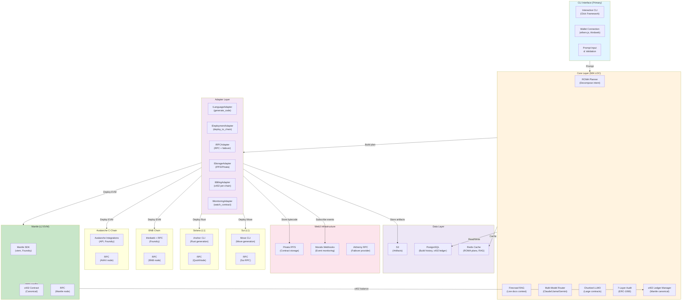

---

## DIAGRAM 2: 90-Second Build Lifecycle with x402

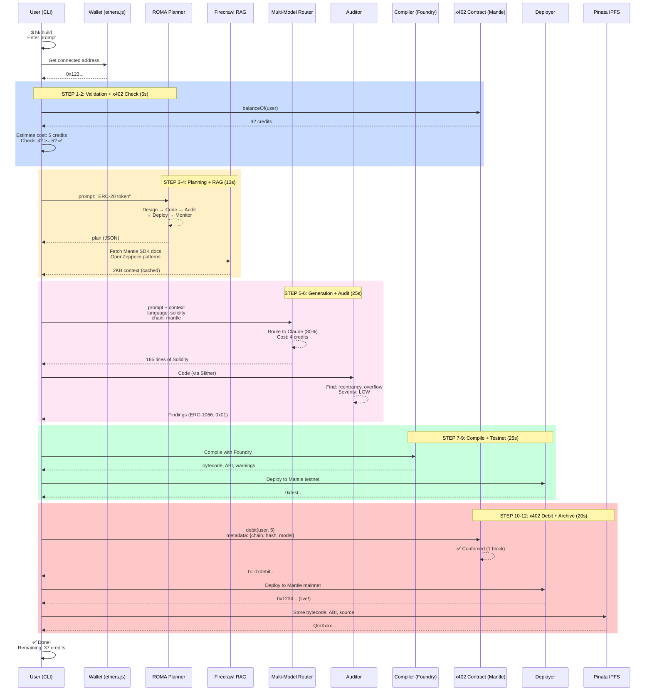

---

## DIAGRAM 3: x402 Billing Flow (Detailed)

```mermaid
graph LR
    subgraph Estimation["1. Cost Estimation"]
        EstRoma["ROMA: 0.5 credits<br/>(cached 60%)"]
        EstLLM["LLM: 3.5 credits<br/>(Claude 4.5)"]
        EstInfra["Infra: 1 credit<br/>(compile, deploy)"]
        EstTotal["TOTAL: 5 credits<br/>≈ $0.05 USD"]
    end
    
    subgraph Validation["2. Pre-Build Check"]
        CheckBal["Query x402:<br/>balanceOf(user)"]
        Result{"Balance >= Cost?"}
        CreditOK["✅ Proceed"]
        Credit402["❌ Show:<br/>402 Payment Required<br/>Suggest top-up"]
    end
    
    subgraph Build["3. Build Process"]
        BuildExec["Execute build<br/>(ROMA → LLM → Audit<br/>→ Compile → Deploy)"]
        Success{"Success?"}
        Undo["❌ Refund<br/>(if partial)"]
        Proceed["✅ Confirmed"]
    end
    
    subgraph Debit["4. x402 Debit"]
        DebitCall["x402.debit(<br/>user: 0x123...,<br/>amount: 5,<br/>metadata: { ... }<br/>)"]
        DebitWait["Wait 1 confirmation"]
        DebitDone["✅ Confirmed<br/>New balance: 37"]
    end
    
    subgraph PostBuild["5. Post-Build"]
        Archive["Archive to IPFS"]
        Monitor["Start monitoring"]
        Return["Return contract details"]
    end
    
    EstRoma --> EstLLM
    EstLLM --> EstInfra
    EstInfra --> EstTotal
    EstTotal --> CheckBal
    
    CheckBal --> Result
    Result -->|Yes| CreditOK
    Result -->|No| Credit402
    Credit402 -->|Top-up| Validation
    
    CreditOK --> BuildExec
    BuildExec --> Success
    Success -->|No| Undo
    Undo --> Validation
    Success -->|Yes| Proceed
    
    Proceed --> DebitCall
    DebitCall --> DebitWait
    DebitWait --> DebitDone
    
    DebitDone --> Archive
    Archive --> Monitor
    Monitor --> Return
    
    style EstTotal fill:#c8e6c9
    style CreditOK fill:#c8e6c9
    style Credit402 fill:#ffccbc
    style DebitDone fill:#c8e6c9
```

---

## DIAGRAM 4: Adapter Pattern (Network-Agnostic Core)

```mermaid
graph TB
    subgraph CoreLogic["Core (Chain-Agnostic)"]
        Build["build(prompt, chain)<br/>generates & audits"]
    end
    
    subgraph AdapterInterfaces["Adapter Interfaces<br/>(Standard contracts)"]
        LangAdapter["ILanguageAdapter<br/>├─ generate_code()<br/>├─ compile()<br/>└─ analyze()"]
        DeployAdapter["IDeploymentAdapter<br/>├─ deploy()<br/>├─ verify()<br/>└─ get_state()"]
        RPCAdapter["IRPCAdapter<br/>├─ call_rpc()<br/>├─ failover()<br/>└─ estimate_gas()"]
        StorageAdapter["IStorageAdapter<br/>├─ upload()<br/>├─ retrieve()<br/>└─ list()"]
        BillingAdapter["IBillingAdapter<br/>├─ check_balance()<br/>├─ debit()<br/>└─ get_rate()"]
    end
    
    subgraph EVMImpl["EVM Adapter<br/>(Mantle, Avax, BNB)"]
        SolidityGen["SolidityLanguageAdapter<br/>→ Foundry"]
        EVMDeploy["EVMDeploymentAdapter<br/>→ RPC call"]
        EVMRpc["EVMRPCAdapter<br/>→ Alchemy/Mantle SDK"]
        EVMStorage["Pinata IPFS"]
        EVMX402["x402 (canonical<br/>on Mantle)"]
    end
    
    subgraph SolanaImpl["Solana Adapter"]
        AnchorGen["AnchorLanguageAdapter<br/>→ Rust/Anchor CLI"]
        SolDeploy["SolanaDeploymentAdapter<br/>→ Solana CLI"]
        SolRpc["SolanaRPCAdapter<br/>→ QuickNode"]
        SolStorage["Arweave"]
        SolX402["Local ledger<br/>+ settlement"]
    end
    
    subgraph SuiImpl["Sui Adapter"]
        MoveGen["MoveLanguageAdapter<br/>→ Move CLI"]
        SuiDeploy["SuiDeploymentAdapter<br/>→ Sui SDK"]
        SuiRpc["SuiRPCAdapter<br/>→ Sui RPC"]
        SuiStorage["IPFS"]
        SuiX402["Local ledger<br/>+ settlement"]
    end
    
    Build -->|query: ILanguageAdapter| LangAdapter
    Build -->|query: IDeploymentAdapter| DeployAdapter
    Build -->|query: IRPCAdapter| RPCAdapter
    Build -->|query: IStorageAdapter| StorageAdapter
    Build -->|query: IBillingAdapter| BillingAdapter
    
    LangAdapter -->|implements| SolidityGen
    LangAdapter -->|implements| AnchorGen
    LangAdapter -->|implements| MoveGen
    
    DeployAdapter -->|implements| EVMDeploy
    DeployAdapter -->|implements| SolDeploy
    DeployAdapter -->|implements| SuiDeploy
    
    RPCAdapter -->|implements| EVMRpc
    RPCAdapter -->|implements| SolRpc
    RPCAdapter -->|implements| SuiRpc
    
    StorageAdapter -->|implements| EVMStorage
    StorageAdapter -->|implements| SolStorage
    StorageAdapter -->|implements| SuiStorage
    
    BillingAdapter -->|implements| EVMX402
    BillingAdapter -->|implements| SolX402
    BillingAdapter -->|implements| SuiX402
    
    style CoreLogic fill:#fff3e0
    style AdapterInterfaces fill:#f3e5f5
    style EVMImpl fill:#c8e6c9
    style SolanaImpl fill:#bbdefb
    style SuiImpl fill:#ffe0b2
```

---

## DIAGRAM 5: x402 Ledger Schema

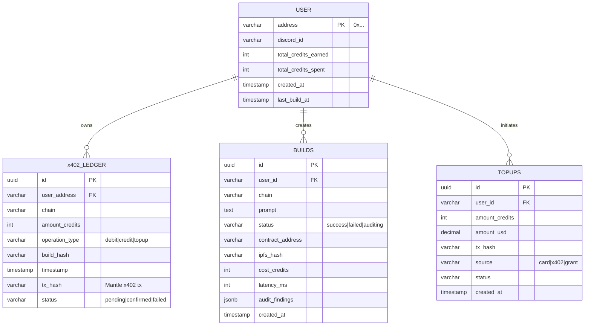

---

## DIAGRAM 6: Chunked LLMO (Large Contract Optimization)

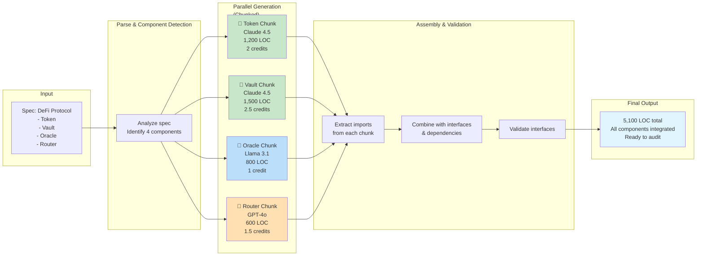

---

## DIAGRAM 7: CLI Interactive Flow

```mermaid
graph TD
    Start["🚀 $ hk build"] --> Connect["Connect wallet<br/>(ethers.js)"]
    Connect --> CheckBalance["Check x402 balance"]
    CheckBalance --> Prompt1["Q1: What to build?<br/>(ERC-20, DEX, DAO, etc.)"]
    Prompt1 --> Input1{"User input"}
    Input1 --> Prompt2["Q2: Which network?<br/>(Mantle, Avalanche, BNB,<br/>Solana, Sui)"]
    Prompt2 --> Input2{"User input"}
    Input2 --> Prompt3["Q3: Requirements?<br/>(Features, constraints)"]
    Prompt3 --> Input3{"User input"}
    Input3 --> Advanced["Advanced options?<br/>(y/n)"]
    Advanced -->|Yes| AdvOpts["Security level<br/>Gas optimization<br/>Upgradeable?"]
    Advanced -->|No| Summary["Show summary<br/>& cost estimate"]
    AdvOpts --> Summary
    
    Summary --> Confirm{"Proceed?<br/>(y/n)"}
    Confirm -->|No| Cancel["❌ Cancelled"]
    Confirm -->|Yes| Build["🔨 Building..."]
    
    Build --> Step1["[⏳ 2s] Validating"]
    Step1 --> Step2["[⏳ 8s] Planning (ROMA)"]
    Step2 --> Step3["[⏳ 5s] Fetching docs (RAG)"]
    Step3 --> Step4["[⏳ 15s] Generating code"]
    Step4 --> Step5["[⏳ 10s] Static audit"]
    Step5 --> Step6["[⏳ 8s] Semantic audit"]
    Step6 --> Step7["[⏳ 5s] Compiling"]
    Step7 --> Step8["[⏳ 20s] Testnet deploy"]
    Step8 --> Step9["[⏳ 2s] x402 debit"]
    Step9 --> Step10["[⏳ 20s] Mainnet deploy"]
    Step10 --> Step11["[⏳ instant] Archive & monitor"]
    
    Step11 --> Success["✅ SUCCESS!<br/>Contract: 0x1234..."]
    Success --> Next["Build another?<br/>Top-up credits?<br/>View dashboard?"]
    Next --> End["Exit"]
    
    Cancel --> End
    
    style Start fill:#bbdefb
    style Success fill:#c8e6c9
    style Build fill:#fff3e0
```

---

## DIAGRAM 8: Infrastructure Deployment (Terraform)

```mermaid
graph TB
    subgraph Cloud["AWS Cloud"]
        subgraph ECS["ECS Cluster (hyperkit-prod)"]
            API["API Service<br/>FastAPI:8000<br/>3 replicas"]
            Worker["CLI Worker Service<br/>Python:build<br/>2-10 replicas (auto-scale)"]
        end
        
        subgraph DB["Data Layer"]
            RDS["RDS PostgreSQL<br/>t4g.medium<br/>Multi-AZ<br/>100GB storage"]
            Cache["ElastiCache Redis<br/>t4g.small<br/>3-node cluster<br/>automatic failover"]
            S3["S3 Artifacts<br/>Build binaries<br/>Contract metadata"]
        end
        
        subgraph Monitor["Observability"]
            Prometheus["Prometheus<br/>Time-series DB<br/>15s scrape"]
            Grafana["Grafana<br/>Dashboards<br/>Alerts"]
            Logs["CloudWatch Logs<br/>ECS logs<br/>Error tracking"]
        end
        
        subgraph Network["Networking"]
            ALB["ALB<br/>Load balancer<br/>443 TLS"]
            VPC["VPC<br/>Private subnets<br/>NAT gateway"]
        end
    end
    
    subgraph External["External Services"]
        Mantle["Mantle Testnet<br/>& Mainnet<br/>(Mantle SDK)"]
        Avalanche["Avalanche API<br/>(Fuji testnet)"]
        BNB["BNB Chain RPC<br/>(BSC testnet)"]
        Solana["Solana RPC<br/>(DevNet)"]
        Sui["Sui RPC<br/>(Testnet)"]
        
        Claude["Claude API<br/>(Anthropic)"]
        Llama["Llama API<br/>(Together.ai)"]
        Gemini["Gemini API<br/>(Google)"]
        
        Pinata["Pinata IPFS<br/>(Contract storage)"]
        Moralis["Moralis Webhooks<br/>(Event monitoring)"]
        Alchemy["Alchemy RPC<br/>(Failover)"]
    end
    
    ALB -->|Routes| API
    API -->|Reads| RDS
    API -->|Caches| Cache
    Worker -->|Stores| S3
    Worker -->|Monitors| Prometheus
    
    API -->|Calls| Mantle
    API -->|Calls| Avalanche
    API -->|Calls| BNB
    Worker -->|Calls| Solana
    Worker -->|Calls| Sui
    
    Worker -->|Calls| Claude
    Worker -->|Calls| Llama
    Worker -->|Calls| Gemini
    
    Worker -->|Uploads| Pinata
    Worker -->|Webhooks| Moralis
    API -->|Fallback| Alchemy
    
    Prometheus --> Grafana
    Logs --> Grafana
    
    style Cloud fill:#e3f2fd
    style ECS fill:#bbdefb
    style DB fill:#c8e6c9
    style Monitor fill:#fff9c4
    style External fill:#f3e5f5
```

---

## DIAGRAM 9: CI/CD Pipeline (GitHub Actions)

```mermaid
graph LR
    subgraph Git["GitHub"]
        Push["Push to main<br/>(commit)"]
    end
    
    subgraph Test["Test Stage"]
        Pytest["pytest (80%<br/>coverage)"]
        Bandit["Security scan<br/>(Bandit)"]
        Ruff["Linting<br/>(Ruff)"]
        Slither["Contract audit<br/>(Slither)"]
    end
    
    subgraph Build["Build Stage"]
        DockerAPI["Build API image<br/>hyperkit/api"]
        DockerCLI["Build CLI image<br/>hyperkit/cli"]
        ScanVuln["Scan for vulns<br/>(Trivy)"]
    end
    
    subgraph Push["Push Stage"]
        ECR["Push to ECR<br/>hyperkit/api:$SHA<br/>hyperkit/cli:$SHA"]
    end
    
    subgraph Deploy["Deploy Stage<br/>(if main branch)"]
        ECSUpdate["Update ECS service<br/>force-new-deployment"]
        Smoke["Smoke tests<br/>curl /health"]
        Monitor["Monitor metrics<br/>(Prometheus)"]
    end
    
    subgraph Alert["Alerting"]
        Slack["Slack notification<br/>(success/failure)"]
        Email["Email on failure"]
    end
    
    Push --> Pytest
    Pytest --> Bandit
    Bandit --> Ruff
    Ruff --> Slither
    
    Slither -->|Pass| DockerAPI
    DockerAPI --> DockerCLI
    DockerCLI --> ScanVuln
    
    ScanVuln -->|Pass| ECR
    ECR --> ECSUpdate
    ECSUpdate --> Smoke
    Smoke --> Monitor
    
    Monitor --> Slack
    Smoke -->|Fail| Email
    
    style Git fill:#bbdefb
    style Test fill:#fff9c4
    style Build fill:#fff9c4
    style Deploy fill:#c8e6c9
    style Alert fill:#ffccbc
```

---

## DIAGRAM 10: RPC Failover Strategy

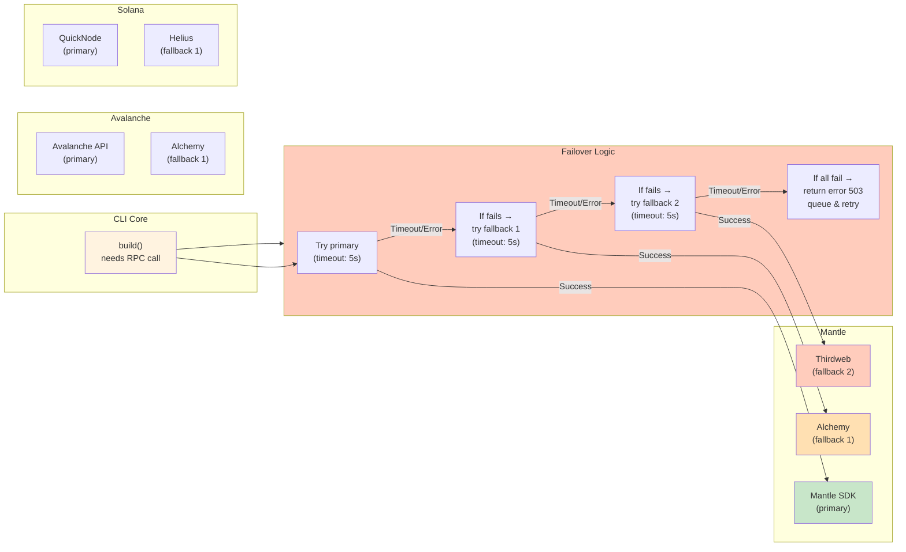

---

## DIAGRAM 11: Build Monitoring & Observability

```mermaid
graph TB
    subgraph Build["Build Execution"]
        BuildProc["build(prompt, chain)<br/>executes 12 steps"]
    end
    
    subgraph Metrics["Metrics Collection"]
        Prom["Prometheus<br/>scrape metrics"]
        Metrics["build_latency<br/>build_success_rate<br/>model_cost<br/>audit_findings<br/>x402_credits_burned"]
    end
    
    subgraph Logging["Logging"]
        Logs["CloudWatch Logs<br/>ECS task logs<br/>stderr/stdout"]
        Entries["[timestamp] Step X<br/>[duration] Y seconds<br/>[status] OK/FAILED"]
    end
    
    subgraph Dashboard["Grafana Dashboards"]
        RealTime["Real-time Dashboard<br/>- Success rate (%)"]
        Latency["- Latency (p99)<br/>- Model distribution"]
        Costs["- Cost breakdown<br/>- x402 credits burned"]
        Errors["- Error rates<br/>- Audit findings severity"]
    end
    
    subgraph Alerting["Alerting (PagerDuty)"]
        Alert1["Success rate < 90%<br/>→ Page on-call"]
        Alert2["Latency p99 > 120s<br/>→ Page on-call"]
        Alert3["x402 contract error<br/>→ Page on-call"]
        Alert4["RPC failover >10 in 1h<br/>→ Slack warning"]
    end
    
    BuildProc --> Prom
    Prom --> Metrics
    BuildProc --> Logs
    Logs --> Entries
    
    Metrics --> RealTime
    Metrics --> Latency
    Metrics --> Costs
    Entries --> Errors
    
    RealTime --> Alert1
    Latency --> Alert2
    Costs --> Alert3
    Errors --> Alert4
    
    style Build fill:#fff3e0
    style Metrics fill:#f3e5f5
    style Dashboard fill:#c8e6c9
    style Alerting fill:#ffccbc
```

---

## DIAGRAM 12: Mantle Global Hackathon Roadmap

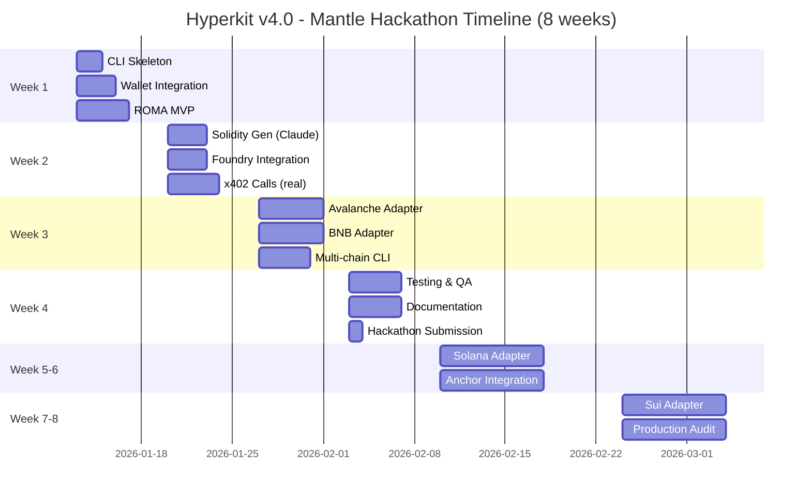

---

## Key Integration Points

### Mantle SDK Integration
```python
from mantle import MantelClient
from mantle.viem import Viem

client = MantelClient(
    rpc_url=os.getenv("MANTLE_RPC_URL"),
    private_key=os.getenv("DEPLOYER_KEY")
)

# Deploy contract
tx_hash = client.send_transaction({
    'to': deployer_address,
    'data': bytecode,
    'gas': 1000000
})
```

### thirdweb x402 Integration
```python
from thirdweb import ThirdwebSDK

sdk = ThirdwebSDK.from_private_key(
    private_key=os.getenv("DEPLOYER_KEY"),
    chain_id=5000  # Mantle
)

x402 = sdk.get_contract("0x[X402_ADDRESS]")
balance = x402.call("balanceOf", [user_address])
tx = x402.call("debit", [user_address, cost])
```

### Pinata IPFS Integration
```python
from pinata import PinataClient

client = PinataClient(
    api_key=os.getenv("PINATA_API_KEY"),
    api_secret=os.getenv("PINATA_API_SECRET")
)

# Upload contract
response = client.pin_file_to_ipfs(
    bytecode,
    metadata={"name": "MyToken", "chain": "mantle"}
)

ipfs_hash = response['IpfsHash']
```

---

**All diagrams are production-ready and can be embedded in documentation or shared with stakeholders.**

