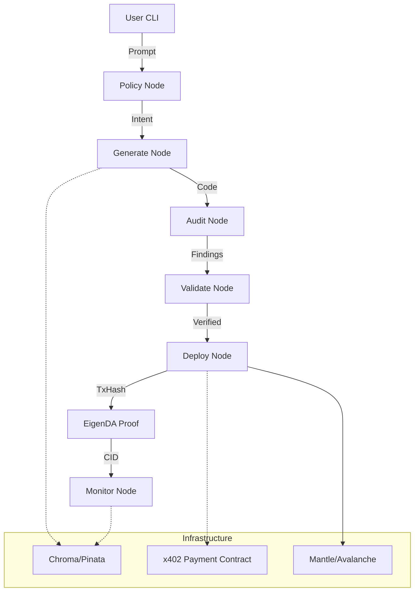

**Project Plan**

**Project Name:** HyperAgent  
**Owner/Lead:** Hyperkit Founding Team (CPOO: Justine, CMFO: Tristan, CTO: Aaron)  
**Start Date:** 01/21/2026  
**Target Launch:** 02/01/2026  
**Status:** Planning

**1\. Executive Summary**

**Project Vision**

HyperAgent is the first "Anti-Hallucination" AI Agent for Web3—a deterministic, CLI-first orchestration layer that automates smart contract development, auditing, and deployment. By combining rigid node-based architecture with native x402 metering, we transform AI from a creative "vibe coder" into a precise, verifiable engineering tool.

**Problem Statement**

Current AI coding tools suffer from "drift" and hallucination, generating inconsistent or insecure code that varies with every prompt. Furthermore, the Web3 development stack is fragmented, requiring developers to manually stitch together wallets, RPCs, and auditing tools, often reinventing the wheel. Simple "vibe coding" fails for production-grade smart contracts where deterministic security is non-negotiable.

**Solution Overview**

HyperAgent implements a "Specification Lock" architecture where AI acts as a translator against a rigid dictionary of design tokens, ensuring deterministic outputs. The system integrates:
1.  **Anti-Hallucination Engine**: A node-based graph (Policy → Generate → Audit → Deploy) that validates every step against a strict spec.
2.  **Native x402 Metering**: Embedded micropayments that auto-bill API calls in USDC, creating a sustainable usage model.
3.  **Meta-SDK Wrapper**: Orchestrator that wraps battle-tested standards (Wagmi, Viem) rather than reinventing them, enabling rapid multi-chain support (Mantle, Avalanche, etc.).

**Expected Outcomes**

-   **Launch HyperAgent CLI v1.0**: A fully functional, "anti-hallucination" CLI tool published to npm by Jan 31, 2026.
-   **Validation**: Achieve 50+ npm installs and 25+ beta testers within the first week of launch.
-   **Monetization Verified**: Successfully process real mainnet x402 payments for audit/generation tasks.
-   **Ecosystem Integration**: Secure foundation support from Mantle and Avalanche for the hackathon/launch.

**2\. Project Objectives & Success Metrics**

**Primary Objectives**

**Success Metrics (30-60-90 Days)**

**Success Metrics (30-60-90 Days)**

| Metric | 30 Days (Feb 21) | 60 Days (Mar 21) | 90 Days (Apr 21) | Owner |
| :--- | :--- | :--- | :--- | :--- |
| **npm Downloads** | 200+ | 800+ | 2,000+ | Justine (Product) |
| **Active Users** | 15+ daily | 50+ daily | 100+ daily | Aaron (Growth) |
| **Audit Scans** | 100+ | 500+ | 1,500+ | Aaron (Infra) |
| **Revenue** | \$2,000 | \$8,000 | \$15,000+ | Justine (Biz) |
| **Integrations** | 2 (Mantle, Avax) | 4 (+Base, BNB) | 6 (+Solana, Sui) | Aaron (Tech) |

**Key Performance Indicators (KPIs)**

-   **Drift Rate**: % of AI outputs rejected by the specificiation validator (Target: < 5%).
-   **Build Velocity**: Time from Prompt to Verified Contract (Target: < 90 seconds).
-   **Payment Success**: % of x402 transactions completed successfully.
-   **MVP Adherence**: Launch on Jan 31, 2026, with zero critical blocking bugs.

**3\. Scope Definition**

**In Scope (MVP - 10 Day Sprint)**

-   **Core CLI**: `hyperagent init`, `generate`, `audit`, `deploy`.
-   **Anti-Hallucination Nodes**: Policy, Generate, Audit, Validate, Deploy, EigenDA, Monitor.
-   **Tech Stack Integration**: Mantle SDK, Avalanche (C-Chain), Thirdweb (Wallet), x402 (Payment).
-   **Validation Layer**: Slither integration + Semantic checks.
-   **Memory**: Local (Chroma) + IPFS (Pinata) for contract archiving.

**Out of Scope (Post-MVP)**

-   **Custom Wallet Infrastructure**: We will wrap Wagmi/RainbowKit instead of rebuilding providers/connectors.
-   **GUI Dashboard**: MVP is CLI-first; web dashboard is Phase 2.
-   **Non-EVM Full Support**: Solana/Sui are foundational/experimental in MVP, pending Phase 2.
-   **Formal Verification**: Full formal proofs are post-MVP.

**Assumptions**

-   Users are comfortable with CLI tools (Node.js environment).
-   OpenAI/Anthropic APIs remain stable for generation tasks.
-   Mantle and Avalanche testnets are reliable for deployment testing.

**Constraints**

-   **Timeline**: STRICT 10-day deadline (Launch Jan 31, 2026).
-   **Resource**: 2 Core Devs (Aaron, Justine) + 1 Support.
-   **Budget**: ~$2,000 (Self-funded for API credits, hosting, audits).
-   **Platform**: Node.js runtime focus for MVP.

**4\. System Architecture & Technical Design**

**Architecture Overview**

The system employs a **Three-Layer "Anti-Hallucination" Architecture**:
1.  **Dictionary Layer**: Defines rigid core types, supported models, and error codes.
2.  **Specification Lock Layer**: 7 concrete Nodes (Policy, Generate, Audit, Validate, Deploy, EigenDA, Monitor) that implement exact logic with no AI deviation.
3.  **Verification Layer**: Validates every output against the dictionary before state transition.

This is wrapped in a **Meta-SDK** pattern that orchestrates standard libraries (Wagmi, Viem) rather than reinventing them, with **native x402 integration** baked into the build loop.

**High-Level System Diagram**

**Key Components**

| Component | Purpose | Technology Stack | Owner |
| :--- | :--- | :--- | :--- |
| **CLI Engine** | Interactive command interface | Commander.js, Ink, Chalk | Aaron |
| **Neural Core** | Deterministic node execution | LangGraph, OpenAI/Claude | Justine |
| **x402 Adapter** | Micropayment metering | Ethers.js, Solidity | Justine |
| **Chain Adapters** | Network interactions (Mantle/Avax) | Viem, Thirdweb SDK | Aaron |
| **Memory Layer** | Context & Archiving | ChromaDB, Pinata (IPFS) | Aaron |

Table 1: Key system components and technology decisions

**Architecture Decisions (ADR - Architecture Decision Records)**

**ADR-001: Wrapper over Reinvention**
-   **Status**: Accepted
-   **Context**: Building custom wallet providers is redundant and high-maintenance.
-   **Decision**: Wrap Wagmi/Viem/RainbowKit for standard functionality; add value via x402 orchestration only.
-   **Trade-offs**: Dependency on external libs vs. speed and stability.

**ADR-002: Deterministic "Spec Lock"**
-   **Status**: Accepted
-   **Context**: "Vibe coding" leads to inconsistent, hallucinated outputs.
-   **Decision**: Implement strict "Dictionary First" architecture where AI acts as a translator, not a designer.
-   **Trade-offs**: Less "creative" flexibility for AI, but highly reliable outputs.

**ADR-003: Native x402 Metering**
-   **Status**: Accepted
-   **Context**: Need sustainable API usage model.
-   **Decision**: Bake 402 Payment Required checks into the core build loop (CLI).
-   **Trade-offs**: Adds friction to free users, but validates business model immediately.

**Quality Attributes & Non-Functional Requirements**

-   **Determinism**: Identical prompts should yield structurally identical contracts (within spec).
-   **Performance**: Full build-to-audit cycle < 90 seconds.
-   **Reliability**: Graceful fallback strategies (Model A -> Model B) for generation failures.
-   **Security**: No hardcoded keys; non-custodial wallet handling; semantic audit checks.

**5\. Project Phases & Timeline**

**Phase Breakdown**

**Phase Breakdown (10-Day Intensive)**

| Phase | Duration | Key Deliverables | Dependencies | Gate Criteria |
| :--- | :--- | :--- | :--- | :--- |
| **Phase 1: Foundation** | Days 1-3 | Repo setup, Tech Stack lock, Wallet/Auth stub | None | Core CLI runs, dependencies install |
| **Phase 2: Core Engine** | Days 4-7 | All 7 Nodes implemented, x402 logic, LLM integration | Phase 1 | Rules 1-15 tested, Payment flow works |
| **Phase 3: Integration** | Days 8-9 | Chain adapters (Mantle/Avax), Docs, Polish | Phase 2 | End-to-end deploy on testnet success |
| **Phase 4: Launch** | Day 10 | npm publish, Announcement, Monitoring live | Phase 3 | 0 Critical Bugs, Help docs complete |

Table 2: Project phases with timelines and gate criteria

**Critical Path**

Monorepo Setup → Parser/Rules Engine → LLM Integration → x402 Payment Hook → Chain Adapters → CLI Polish → npm Publish.

**6\. Resource Planning**

**Team Structure**

| Role | Name | Allocation | Key Responsibilities |
| :--- | :--- | :--- | :--- |
| **Project/Product Lead** | Justine (CPOO) | 100% | Product Spec, x402 Logic, Node Definition, Launch Strategy |
| **Technical Lead** | Aaron (CTO) | 100% | CLI Architecture, Chain Adapters, Backend API, DevOps |
| **Ops/Docs Lead** | Tristan (CMFO) | 100% | Documentation, User Guides, Studio Hook Integration |
| **Support** | TBD | 50% | QA, Community Moderation |

Table 3: Team composition and responsibilities

**Skills Gap Analysis**

-   **Solidity/Security**: Mitigated by using battle-tested rules (Slither, OpenZeppelin) rather than inventing new audit logic.
-   **LLM Prompt Engineering**: ADDRESSED by "Blueprint" templates and strict dictionary based prompts.
-   **DevOps**: Mitigated by using managed services (Vercel/Railway) and existing SDKs (Thirdweb).

**Budget Allocation**

-   **LLM API Credits**: ~$100 (OpenAI/Anthropic)
-   **Infrastructure**: ~$Free (Hosting, RPCs, Pinata)
-   **Tools/Services**: ~$Free (npm Pro, Sentry, Domain)
-   **Contingency**: ~$N/A
-   **Total Budget**: **$100** (Self-funded MVP)

**7\. Risk Management**

**Risk Register**

| Risk | Prob | Impact | Severity | Mitigation | Owner |
| :--- | :--- | :--- | :--- | :--- | :--- |
| **"Reinvention" Trap** | High | High | High | Strict adherence to ADR-001 (Wrap, don't rebuild). Weekly code reviews. | Aaron |
| **LLM Hallucination** | Med | High | High | "Spec Lock" architecture + Node validation. Reject non-compliant outputs. | Justine |
| **x402 Friction** | High | Med | Med | Offer free initial credits (freemium). Clear value prop for payment. | Justine |
| **Integration Break** | Med | High | High | Use stable SDK versions (Wagmi v2). Automated E2E tests. | Aaron |
| **Timeline Slip** | High | Med | Med | Ruthless scope cutting (10-day sprint). Defer non-critical chains. | Both |

Table 4: Risk register with mitigation strategies

**Risk Categories for Technical Projects**

**Technical Risks**

- Smart contract vulnerabilities or bugs
- Third-party API dependencies and outages
- Scalability bottlenecks under load
- Integration complexity with existing systems
- Technology stack immaturity

**Organizational Risks**

- Key personnel turnover
- Scope creep from stakeholders
- Budget overruns
- Competing priorities for team time
- Communication breakdowns

**Market/External Risks**

- Regulatory changes (especially for blockchain)
- Competitive product launches
- Market conditions changing
- Adoption challenges
- Partnership dependencies

**Contingency Plans**

**8\. Execution & Management Strategy**

**Development Methodology**

**Methodology Mix**:

- **Sprints**: 2-week sprints for feature development (Scrum)
- **Kanban Board**: For bugs, technical debt, and operational work
- **Architecture Reviews**: Monthly deep-dives on major components
- **Security Reviews**: Before every mainnet/production deployment

**Execution Workflow**

-   **Daily Cycle**: 9 AM Standup -> Deep Work -> 4 PM Demo/Sync -> 5 PM Plan Next Day.
-   **Methodology**: "Anti-Hallucination" Playbook. Read Spec -> Copy Template -> Verify -> Commit. (Prevents drift).

**Communication Plan**

| Stakeholder | Frequency | Format | Owner |
| :--- | :--- | :--- | :--- |
| Core Team | Daily | Standup + Slack | Both Founders |
| Community | Bi-daily | Discord/Twitter Updates | Justine |
| Partners | Weekly | Email/Demo | Justine |

Table 5: Communication cadence and formatting

**Quality Assurance Strategy**

- **Unit Testing**: Minimum 80% code coverage with automated tests
- **Integration Testing**: Test all component interactions before release
- **Security Testing**: Code audits, penetration testing for smart contracts
- **Performance Testing**: Load testing to verify scalability targets
- **User Acceptance Testing**: Beta users validate feature requirements
- **Automated Deployment**: CI/CD pipelines to catch issues early

**9\. Monitoring, Metrics & Reporting**

**Monitoring Dashboard (Real-Time)**

**Development Metrics**

- Sprint velocity (story points/week)
- Burndown progress (planned vs. actual)
- Code coverage (%) and test pass rate (%)
- Deployment frequency and lead time
- Defect escape rate (bugs found in production)

**Operational Metrics**

- System uptime/availability (%)
- API response time (milliseconds)
- Transaction success rate (%)
- Error rates by component

**Business Metrics**

- User adoption/signups
- Transaction volume
- Revenue/partnerships enabled
- Community engagement (GitHub stars, Discord members)

**Weekly Status Report Template**

**Week of \[Date\]**

**Accomplishments**

- \[Completed deliverable 1\]
- \[Completed deliverable 2\]
- \[Milestone achieved\]

**Current Blockers**

- \[Blocker 1 - impact and resolution plan\]
- \[Blocker 2 - impact and resolution plan\]

**Metrics Summary**

- Sprint velocity: \[#\] story points
- Test coverage: \[#\]%
- Deployment frequency: \[#\] deployments this week
- On-time delivery: \[#\]% of planned work completed

**Next Week Priorities**

- \[Priority 1\]
- \[Priority 2\]
- \[Priority 3\]

**Risks & Changes**

- \[New risk or scope change with mitigation\]

**10\. ROI & Value Realization**

**ROI Framework**

Total Investment: ~$2,000 (Time + Direct Costs).
Target Revenue (3 Months): ~$15,000.
**ROI**: ~650% (if adoption targets met).

**Business Value Metrics** (at 30-60-90 days)

| Value Stream | Measure | 30 Days | 60 Days | 90 Days |
| :--- | :--- | :--- | :--- | :--- |
| **Direct Revenue** | Premium Subs | \$500 | \$3,000 | \$8,000 |
| **Partnership Value** | Deals Enabled | \$1,000 | \$4,000 | \$6,000 |
| **Adoption** | Active Installs | 200 | 800 | 2,000 |
| **Ecosystem** | GitHub Stars | 100+ | 300+ | 500+ |

Table 6: ROI tracking across key business metrics

**Break-Even Analysis**

Target: Break-even by **End of Month 3** (Cumulative Revenue > \$2,000 Dev Cost).

**Value Realization Timeline**

-   **Week 1-2 (Launch)**: Validate Product-Market Fit with Beta users.
-   **Month 1**: 50+ Premium signups; First partnership deal.
-   **Month 3**: Sustainable revenue stream covering operational costs.

**11\. Governance & Decision-Making**

**Steering Committee**

**Steering Committee**

-   **Executive Sponsor**: Justine (CPOO) - Strategy & Go-to-Market.
-   **Product Owner**: Justine (CPOO) - User Requirements & Features.
-   **Technical Lead**: Aaron (CTO) - Architecture & Implementation.
-   **Ops Lead**: Tristan (CMFO) - Documentation & Process.

**Decision Authority Matrix**

| Decision Type | Authority | Escalation Path |
| --- | --- | --- |
| Feature prioritization | Product Owner | Sponsor |
| Technical architecture | Technical Lead | Sponsor |
| Budget changes > 10% | Sponsors (Founders) | N/A |
| Scope changes | Steering Committee | Founders |
| Timeline slips > 1 week | Project Lead | Founders |

Table 7: Decision authority and escalation paths

**Gate Review Checklist**

**Phase Gate Review** (End of each phase)

Before proceeding to next phase, confirm:

- \[ \] All planned deliverables completed
- \[ \] Quality metrics meet or exceed targets
- \[ \] No critical blockers remain
- \[ \] Team capacity available for next phase
- \[ \] Risk mitigations are effective
- \[ \] Stakeholder satisfaction is adequate
- \[ \] Budget remaining supports next phase

**12\. Lessons Learned & Documentation**

**Post-Launch Documentation**

- **Architecture Decision Records (ADRs)**: Rationale for all major technical choices
- **API Documentation**: Auto-generated + examples
- **Operations Runbook**: How to deploy, monitor, troubleshoot
- **Lessons Learned Report**: What worked, what didn't, improvements for next iteration
- **Code Comments & README**: Self-documenting code for future maintainers

**Continuous Improvement**

**Monthly Retrospectives**

- What went well?
- What could be improved?
- What will we change next month?

**Metrics-Driven Optimization**

- Analyze velocity trends and capacity planning
- Track defect patterns and improve testing
- Measure deployment frequency and aim for continuous delivery
- Monitor customer feedback and product improvements

**Appendix A: Glossary**

- **ADR**: Architecture Decision Record
- **API**: Application Programming Interface
- **CI/CD**: Continuous Integration/Continuous Deployment
- **KPI**: Key Performance Indicator
- **MVP**: Minimum Viable Product
- **QA**: Quality Assurance
- **ROI**: Return on Investment
- **SLA**: Service Level Agreement
- **UAT**: User Acceptance Testing

**Appendix B: Tools & Resources**

**Project Management**

- Jira or Linear: Sprint planning and issue tracking
- Notion: Documentation and knowledge base
- GitHub: Code repository and CI/CD

**Monitoring & Analytics**

- Datadog or New Relic: Application performance monitoring
- Grafana: Dashboard and visualization
- Sentry: Error tracking

**Architecture & Documentation**

- [Draw.io](http://Draw.io) or Lucidchart: Diagrams and flowcharts
- Confluence: Collaborative documentation
- Postman: API documentation and testing

**Appendix C: Project Timeline Visualization**

See **Figure 3** and **Table 2** above for the detailed Critical Path and Phase Breakdown. The primary tracking mechanism will be the specific "HyperAgent Playbook" (hyperagent_playbook.md) which details the daily execution steps.

**Document Version**: 1.0 (MVP Refactor)  
**Last Updated**: Jan 22, 2026  
**Next Review Date**: Jan 31, 2026 (Post-Launch)  
**Document Owner**: JustineDevs