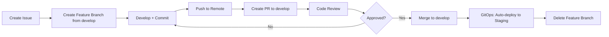
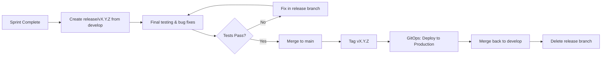
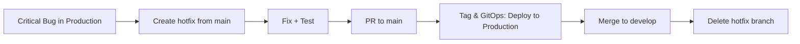
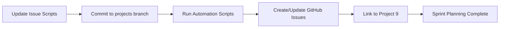
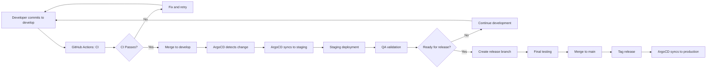

# HyperAgent Git Branching Strategy

**Version:** 2.0.0  
**Last Updated:** 2026-02-06  
**Major Update:** Migrated from trunk-based to GitFlow strategy  
**Owner:** @JustineDevs (CPOO/Product Lead)  
**Reviewers:** @ArhonJay (CTO), @Tristan-T-Dev (Frontend Lead)

---

## Table of Contents

1. [Overview](#overview)
2. [Branch Structure](#branch-structure)
3. [Branching Strategy](#branching-strategy)
4. [Workflow Patterns](#workflow-patterns)
5. [Environment Deployment](#environment-deployment)
6. [Branch Protection Rules](#branch-protection-rules)
7. [CI/CD Integration](#cicd-integration)
8. [GitOps Integration](#gitops-integration)
9. [Best Practices](#best-practices)
10. [Team Responsibilities](#team-responsibilities)

---

## Overview

HyperAgent uses **GitFlow** branching strategy with **GitOps** deployment patterns to support:

- **Multi-sprint delivery** (Phase 1: Sprints 1-3, Phase 4-5)
- **Multi-team collaboration** (JustineDevs, ArhonJay, Tristan-T-Dev)
- **Microservices architecture** (orchestration, agents, frontend, contracts)
- **Multi-environment deployments** (dev, staging, production)
- **Continuous integration** and **continuous deployment** (CI/CD)
- **Scheduled releases** with release branches for stabilization
- **GitHub Projects automation** via dedicated `projects` branch

### GitFlow Strategy

GitFlow is ideal for:
- ✅ **Large projects** with scheduled releases
- ✅ **Complex development cycles** requiring stabilization phases
- ✅ **Multiple concurrent features** needing integration testing
- ✅ **Production stability** with clear separation of development and production code
- ✅ **Release management** with dedicated release branches

### Design Principles

Based on `.cursor/skills/gitops-principles-skill/` and `.cursor/skills/gitops-workflow/`:

1. **Declarative** - All configurations in Git (YAML, code, IaC)
2. **Versioned** - Complete audit trail of all changes
3. **Pull-based** - GitOps controllers pull from Git (not push)
4. **Continuously Reconciled** - Automated drift detection and correction
5. **Branch-based Environments** - Each environment tracks a specific branch
6. **Immutable Infrastructure** - Infrastructure defined as code, versioned in Git

---

## Branch Structure

```
main (master) ────────────────────────────────────────► Production (stable, tagged)
  │                                                      │
  │                                                      ├─► Tag: v1.0.0, v1.1.0, etc.
  │                                                      │
  ├── develop ────────────────────────────────────────► Staging (auto-deploy via GitOps)
  │     │                                                │
  │     ├── feature/ISSUE-123-supabase-schema ────────► Feature development
  │     ├── feature/ISSUE-124-fastapi-gateway ────────► Feature development
  │     ├── bugfix/ISSUE-150-rate-limiting ───────────► Bug fixes (merged to develop)
  │     └── chore/ISSUE-160-update-deps ──────────────► Maintenance tasks
  │
  ├── release/v0.1.0 ─────────────────────────────────► Release candidate (from develop)
  │     │                                                │
  │     └──► Merge to main + develop ──────────────────┘
  │
  ├── hotfix/ISSUE-200-critical-security ─────────────► Emergency fixes (from main)
  │     │                                                │
  │     └──► Merge to main + develop ──────────────────┘
  │
  └── projects ────────────────────────────────────────► GitHub Projects Automation
        │                                                │
        └──► Sprint producer, issue automation ─────────┘
```

### Branch Purposes

| Branch Type | Source | Purpose | Deployment | Lifespan | GitOps Target |
|-------------|--------|---------|------------|----------|---------------|
| **main** (or master) | - | Production-ready code, stable, tagged with versions | Production (manual gate) | Permanent | ArgoCD: `main` (tags) |
| **develop** | Branches off `main` | Integration branch for upcoming features | Staging (auto-deploy) | Permanent | ArgoCD: `develop` (auto-sync) |
| **feature/** | Branches from `develop` | Isolated work for new features | Dev (manual) | Short-lived | Manual deploy |
| **bugfix/** | Branches from `develop` | Bug fixes for develop branch | Dev (manual) | Short-lived | Manual deploy |
| **release/** | Branches from `develop` | Final release prep, stabilization | Pre-prod validation | Until merged | ArgoCD: `release/*` (manual) |
| **hotfix/** | Branches from `main` | Urgent production fixes | Production (urgent) | Short-lived | ArgoCD: `hotfix/*` (manual) |
| **chore/** | Branches from `develop` | Maintenance, deps, refactoring | Dev (manual) | Short-lived | Manual deploy |
| **projects** | Branches from `main` | GitHub Projects Issues Automation and sprint producer | N/A (automation only) | Permanent | N/A |

**Note on Current Repository:**
- Current branch: `development` (exists)
- GitFlow standard: `develop` (recommended)
- **Action:** Consider renaming `development` → `develop` for GitFlow compliance, or use `development` as the integration branch name.

---

## Branching Strategy

### GitFlow Model

HyperAgent follows the **GitFlow** branching model, which provides:

- ✅ **Clear separation** between development and production code
- ✅ **Stabilization phase** via release branches before production
- ✅ **Parallel development** with multiple feature branches
- ✅ **Emergency fixes** via hotfix branches from main
- ✅ **Scheduled releases** with predictable release cycles
- ✅ **GitOps integration** with branch-based environment mapping

**Why GitFlow for HyperAgent?**

From `.cursor/skills/gitops-principles-skill/references/patterns-and-practices.md`:

- ✅ **Large project** - Complex microservices architecture benefits from structured branching
- ✅ **Scheduled releases** - Phase 1-5 roadmap requires planned release cycles
- ✅ **Multi-team** - Clear branch ownership reduces conflicts
- ✅ **Production stability** - Release branches ensure quality before production
- ✅ **GitOps alignment** - Branch-based deployments map cleanly to environments

### Branch Naming Convention

```bash
# Format: <type>/<issue-number>-<short-description>

# Features (new functionality) - from develop
feature/ISSUE-123-supabase-schema
feature/ISSUE-124-langraph-orchestrator

# Bug fixes - from develop
bugfix/ISSUE-150-redis-connection-leak
bugfix/ISSUE-151-auth-token-validation

# Hotfixes (critical production issues) - from main
hotfix/ISSUE-200-security-patch
hotfix/ISSUE-201-memory-leak

# Chores (maintenance, dependencies, refactoring) - from develop
chore/ISSUE-160-upgrade-fastapi
chore/ISSUE-161-add-linting

# Release branches - from develop
release/v0.1.0
release/v0.2.0

# Epic tracking branches (optional, for coordination) - from develop
epic/ISSUE-100-core-orchestration

# Projects branch (GitHub Projects automation)
projects  # Permanent branch for issue automation scripts
```

---

## Workflow Patterns

### 1. Feature Development Workflow



**Step-by-Step:**

```bash
# 1. Pull latest develop
git checkout develop
git pull origin develop

# 2. Create feature branch from develop
git checkout -b feature/ISSUE-123-supabase-schema

# 3. Develop and commit (following conventional commits)
git add .
git commit -m "feat(db): design Supabase schema for multi-tenant workspaces

- Add workspaces table with RLS policies
- Add projects, runs, artefacts tables
- Implement foreign key relationships
- Add indexes for performance

Relates to: #123"

# 4. Push to remote
git push -u origin feature/ISSUE-123-supabase-schema

# 5. Create Pull Request (PR) to develop
gh pr create --base develop --title "feat(db): Supabase multi-tenant schema" --body "Closes #123"

# 6. After approval, merge (squash merge recommended)
# GitHub will auto-delete branch after merge

# 7. GitOps: ArgoCD auto-syncs develop → staging
# 8. Pull updated develop
git checkout develop
git pull origin develop
```

### 2. Release Workflow (GitFlow)



**Step-by-Step:**

```bash
# 1. Create release branch from develop (at end of sprint)
git checkout develop
git pull origin develop
git checkout -b release/v0.1.0

# 2. Update version numbers, CHANGELOG.md
# Edit: package.json, pyproject.toml, VERSION file
git add .
git commit -m "chore(release): prepare v0.1.0 release"

# 3. Push release branch
git push -u origin release/v0.1.0

# 4. Run final integration tests, UAT (User Acceptance Testing)
# If bugs found, fix them in release branch (not develop)
# Example: git commit -m "fix(release): resolve integration test failure"

# 5. Create PR to main (requires approval)
gh pr create --base main --title "Release v0.1.0" --body "Release notes..."

# 6. After approval, merge to main (squash or merge commit)
# DO NOT DELETE release branch yet

# 7. Tag the release on main
git checkout main
git pull origin main
git tag -a v0.1.0 -m "Release v0.1.0 - Phase 1 Sprint 1"
git push origin v0.1.0

# 8. GitOps: ArgoCD will detect tag and sync production
# Or manually trigger: argocd app sync hyperagent-production

# 9. Merge release back to develop (to sync any fixes made in release)
git checkout develop
git merge release/v0.1.0
git push origin develop

# 10. Now delete release branch
git branch -d release/v0.1.0
git push origin --delete release/v0.1.0
```

### 3. Hotfix Workflow (GitFlow)



**Step-by-Step:**

```bash
# 1. Create hotfix branch from main (NOT develop)
git checkout main
git pull origin main
git checkout -b hotfix/ISSUE-200-critical-security

# 2. Fix the issue
git add .
git commit -m "fix(security): patch critical auth vulnerability

- Validate JWT signatures correctly
- Add rate limiting to auth endpoints
- Update security tests

BREAKING: Requires immediate deployment
Fixes: #200"

# 3. Push and create PR to main (expedited review)
git push -u origin hotfix/ISSUE-200-critical-security
gh pr create --base main --title "HOTFIX: Critical security patch" --label "priority:critical"

# 4. After approval, merge to main
# Tag immediately with patch version bump
git checkout main
git pull origin main
git tag -a v0.1.1 -m "Hotfix v0.1.1 - Security patch"
git push origin v0.1.1

# 5. GitOps: ArgoCD detects tag and syncs production
# Or manually: argocd app sync hyperagent-production

# 6. Merge to develop as well (to prevent regression)
git checkout develop
git merge hotfix/ISSUE-200-critical-security
git push origin develop

# 7. Delete hotfix branch
git branch -d hotfix/ISSUE-200-critical-security
git push origin --delete hotfix/ISSUE-200-critical-security
```

### 4. Projects Branch Workflow (GitHub Projects Automation)



**Purpose:**
The `projects` branch is dedicated to GitHub Projects automation and sprint planning. It contains:
- Issue creation scripts (`scripts/github/create_phase*_issues.py`)
- Issue data files (`scripts/data/issues.csv`)
- Automation documentation
- Sprint planning tools

**Step-by-Step:**

```bash
# 1. Create projects branch from main (one-time setup)
git checkout main
git pull origin main
git checkout -b projects

# 2. Work on automation scripts
git add scripts/github/create_phase1_issues.py
git commit -m "feat(automation): add Phase 1 issue creation script"

# 3. Run automation scripts
cd scripts/github
python create_phase1_issues.py --csv ../data/issues.csv

# 4. Commit any generated artifacts (if needed)
git add scripts/data/
git commit -m "chore(automation): update issue data for Sprint 1-3"

# 5. Push to remote
git push -u origin projects

# 6. Keep projects branch in sync with main (periodically)
git checkout projects
git merge main
git push origin projects
```

**Important Notes:**
- `projects` branch is **permanent** and never merged to `develop` or `main`
- Automation scripts run from this branch
- Keep branch updated with main for latest code patterns
- Use this branch for all GitHub Projects-related work

---

## Environment Deployment

### Environment Mapping (GitOps)

| Environment | Git Source | Deployment Method | Auto-Deploy | Approval Required | ArgoCD Application |
|-------------|-----------|-------------------|-------------|-------------------|---------------------|
| **Development** | `feature/*`, `develop` | Manual (developer-triggered) | No | No | N/A (manual) |
| **Staging** | `develop` branch | GitOps (ArgoCD auto-sync) | Yes | No | `hyperagent-staging` |
| **Production** | `main` branch (tags) | GitOps (ArgoCD manual sync) | No | Yes (@JustineDevs or @ArhonJay) | `hyperagent-production` |
| **Release Candidate** | `release/*` branches | GitOps (ArgoCD manual sync) | No | Yes (QA team) | `hyperagent-release-*` |
| **Hotfix** | `hotfix/*` branches | GitOps (ArgoCD manual sync) | No | Yes (expedited) | `hyperagent-hotfix-*` |

### Deployment Configuration (GitOps)

Following GitOps principles from `.cursor/skills/gitops-principles-skill/`:

**1. Staging Environment (Auto-Sync from `develop`):**

```yaml
# argocd/applications/hyperagent-staging.yaml
apiVersion: argoproj.io/v1alpha1
kind: Application
metadata:
  name: hyperagent-staging
  namespace: argocd
spec:
  project: hyperagent
  source:
    repoURL: https://github.com/hyperkit-labs/Hyperkit_agent.git
    targetRevision: develop  # Track develop branch (GitFlow)
    path: k8s/overlays/staging
  destination:
    server: https://kubernetes.default.svc
    namespace: hyperagent-staging
  syncPolicy:
    automated:
      prune: true        # Auto-delete resources not in Git
      selfHeal: true     # Auto-revert manual changes
      allowEmpty: false
    syncOptions:
      - CreateNamespace=true
      - PrunePropagationPolicy=foreground
      - PruneLast=true
  revisionHistoryLimit: 10
```

**2. Production Environment (Manual Sync from `main` tags):**

```yaml
# argocd/applications/hyperagent-production.yaml
apiVersion: argoproj.io/v1alpha1
kind: Application
metadata:
  name: hyperagent-production
  namespace: argocd
spec:
  project: hyperagent
  source:
    repoURL: https://github.com/hyperkit-labs/Hyperkit_agent.git
    targetRevision: v0.1.0  # Track specific tags (GitFlow releases)
    path: k8s/overlays/production
  destination:
    server: https://kubernetes.default.svc
    namespace: hyperagent-production
  syncPolicy:
    automated: null    # Manual sync only (requires approval)
    syncOptions:
      - CreateNamespace=true
      - PrunePropagationPolicy=foreground
  revisionHistoryLimit: 20  # Keep more history for production
```

**3. Release Candidate (Manual Sync from `release/*` branches):**

```yaml
# argocd/applications/hyperagent-release-v0.1.0.yaml
apiVersion: argoproj.io/v1alpha1
kind: Application
metadata:
  name: hyperagent-release-v0.1.0
  namespace: argocd
spec:
  project: hyperagent
  source:
    repoURL: https://github.com/hyperkit-labs/Hyperkit_agent.git
    targetRevision: release/v0.1.0  # Track release branch (GitFlow)
    path: k8s/overlays/production
  destination:
    server: https://kubernetes.default.svc
    namespace: hyperagent-release
  syncPolicy:
    automated: null    # Manual sync for QA validation
    syncOptions:
      - CreateNamespace=true
```

**4. Hotfix (Manual Sync from `hotfix/*` branches):**

```yaml
# argocd/applications/hyperagent-hotfix-security.yaml
apiVersion: argoproj.io/v1alpha1
kind: Application
metadata:
  name: hyperagent-hotfix-security
  namespace: argocd
spec:
  project: hyperagent
  source:
    repoURL: https://github.com/hyperkit-labs/Hyperkit_agent.git
    targetRevision: hotfix/ISSUE-200-critical-security  # Track hotfix branch
    path: k8s/overlays/production
  destination:
    server: https://kubernetes.default.svc
    namespace: hyperagent-production  # Deploy to production
  syncPolicy:
    automated: null    # Manual sync (expedited approval)
    syncOptions:
      - CreateNamespace=true
```

### Directory Structure for Overlays

```
Hyperkit_agent/
├── k8s/
│   ├── base/                      # Shared Kubernetes manifests
│   │   ├── deployment.yaml
│   │   ├── service.yaml
│   │   ├── configmap.yaml
│   │   └── kustomization.yaml
│   └── overlays/                  # Environment-specific patches
│       ├── dev/
│       │   ├── kustomization.yaml
│       │   ├── replicas-patch.yaml   # 1 replica for dev
│       │   └── env-vars.yaml
│       ├── staging/
│       │   ├── kustomization.yaml
│       │   ├── replicas-patch.yaml   # 2 replicas for staging
│       │   └── env-vars.yaml
│       └── production/
│           ├── kustomization.yaml
│           ├── replicas-patch.yaml   # 5 replicas for prod
│           ├── env-vars.yaml
│           └── hpa.yaml              # Horizontal Pod Autoscaler
```

---

## Branch Protection Rules

### Protected Branches

#### `main` Branch (Production)

```yaml
Protection Rules:
  - Require pull request before merging: true
  - Required approvals: 2 (must include @JustineDevs or @ArhonJay)
  - Dismiss stale reviews: true
  - Require review from Code Owners: true
  - Required status checks:
      - ci/tests-backend
      - ci/tests-frontend
      - ci/tests-contracts
      - ci/security-scan
      - ci/lint
  - Require branches to be up to date: true
  - Require conversation resolution: true
  - Require signed commits: false (optional for Phase 1)
  - Include administrators: false (emergency override allowed)
  - Restrict pushes: true (only via PR)
  - Allow force pushes: false
  - Allow deletions: false
```

#### `develop` Branch (Staging)

**Note:** Current repository has `development` branch. Consider renaming to `develop` for GitFlow compliance, or use `development` as the integration branch.

```yaml
Protection Rules:
  - Require pull request before merging: true
  - Required approvals: 1 (any team member)
  - Dismiss stale reviews: false
  - Require review from Code Owners: true
  - Required status checks:
      - ci/tests-backend
      - ci/tests-frontend
      - ci/lint
  - Require branches to be up to date: true
  - Require conversation resolution: true
  - Include administrators: false
  - Restrict pushes: true (only via PR)
  - Allow force pushes: false
  - Allow deletions: false
```

#### `projects` Branch (GitHub Projects Automation)

```yaml
Protection Rules:
  - Require pull request before merging: true
  - Required approvals: 1 (any team member)
  - Dismiss stale reviews: false
  - Require review from Code Owners: false (automation scripts)
  - Required status checks:
      - ci/lint (if applicable)
  - Require branches to be up to date: false (can merge from main)
  - Require conversation resolution: false
  - Include administrators: true (for automation updates)
  - Restrict pushes: false (allow direct pushes for automation)
  - Allow force pushes: false
  - Allow deletions: false
```

**Rationale:**
- `projects` branch is for automation scripts, not production code
- Less strict rules allow rapid iteration on automation
- Still requires PR for visibility and review
- Can merge from `main` to keep scripts updated

### CODEOWNERS Configuration

```
# .github/CODEOWNERS

# Global owners (require approval from at least one)
* @JustineDevs @ArhonJay

# Frontend (requires Tristan-T-Dev approval)
/apps/web/ @Tristan-T-Dev @JustineDevs
*.tsx @Tristan-T-Dev
*.css @Tristan-T-Dev
/frontend/ @Tristan-T-Dev

# Backend/Orchestration (requires JustineDevs or ArhonJay)
/hyperagent/api/ @JustineDevs @ArhonJay
/hyperagent/core/ @JustineDevs @ArhonJay
/hyperagent/db/ @JustineDevs

# Smart Contracts (requires ArhonJay)
/contracts/ @ArhonJay
*.sol @ArhonJay
/hardhat/ @ArhonJay
/foundry/ @ArhonJay

# Infrastructure/DevOps (requires ArhonJay)
/.github/ @ArhonJay @JustineDevs
/k8s/ @ArhonJay
/docker/ @ArhonJay
Dockerfile @ArhonJay
docker-compose.yml @ArhonJay

# GitHub Projects Automation (projects branch)
/scripts/github/ @JustineDevs @ArhonJay
/scripts/data/ @JustineDevs

# Documentation (any team member can approve)
/docs/ @JustineDevs @ArhonJay @Tristan-T-Dev
*.md @JustineDevs

# Security-sensitive (requires both JustineDevs and ArhonJay)
/hyperagent/security/ @JustineDevs @ArhonJay
/contracts/security/ @ArhonJay @JustineDevs
```

---

## CI/CD Integration

[Previous CI/CD content remains the same - see original file]

---

## GitOps Integration

### GitOps Principles Applied

Following `.cursor/skills/gitops-principles-skill/`:

1. **Declarative Configuration**
   - All Kubernetes manifests in `k8s/` directory
   - Infrastructure as Code (Terraform/Pulumi) in `infra/`
   - Environment configs via Kustomize overlays

2. **Versioned and Immutable**
   - Git tags for production releases
   - Branch-based versioning (develop, release/*, hotfix/*)
   - Complete audit trail in Git history

3. **Pull-based Deployment**
   - ArgoCD pulls from Git (not CI pushes)
   - No cluster credentials in CI/CD
   - Secure, auditable deployments

4. **Continuous Reconciliation**
   - ArgoCD continuously syncs desired state
   - Auto-revert manual changes (self-heal)
   - Drift detection and correction

### GitOps Workflow



### ArgoCD Application Sync Policies

**Staging (develop branch):**
- **Auto-sync:** Enabled
- **Self-heal:** Enabled
- **Prune:** Enabled
- **Sync window:** Always

**Production (main tags):**
- **Auto-sync:** Disabled (manual only)
- **Self-heal:** Enabled
- **Prune:** Enabled
- **Sync window:** Business hours only

**Release (release/* branches):**
- **Auto-sync:** Disabled (manual for QA)
- **Self-heal:** Enabled
- **Prune:** Enabled

**Hotfix (hotfix/* branches):**
- **Auto-sync:** Disabled (manual, expedited)
- **Self-heal:** Enabled
- **Prune:** Enabled

---

## Best Practices

[Previous best practices content remains - see original file]

---

## Team Responsibilities

[Previous team responsibilities content remains - see original file]

---

## Quick Reference

[Previous quick reference content remains - see original file]

---

## Versioning Strategy

[Previous versioning content remains - see original file]

---

## Troubleshooting

[Previous troubleshooting content remains - see original file]

---

## Migration Plan

### Phase 1: Immediate Setup (Week 1)

- [x] Create `develop` branch from `main`
- [x] Create `projects` branch from `main`
- [ ] Configure branch protection rules (main, develop, projects)
- [x] Add CODEOWNERS file
- [ ] Set up GitHub Actions workflows (lint, test)
- [ ] Document in team wiki/Notion

### Phase 2: Team Onboarding (Week 2)

- [ ] Team training session on GitFlow branching strategy
- [ ] Walk through first feature branch → PR → merge
- [ ] Set up Git aliases and CLI tools (gh, tig, etc.)
- [ ] Configure local Git hooks (pre-commit, commit-msg)

### Phase 3: GitOps Setup (Week 3)

- [ ] Install ArgoCD in cluster
- [ ] Create ArgoCD Applications for staging/prod (tracking develop/main)
- [ ] Configure auto-sync for staging (develop branch), manual for prod (main tags)
- [ ] Set up ArgoCD Applications for release/* and hotfix/* branches
- [ ] Configure Slack notifications for deployments
- [ ] Set up GitOps repository structure (k8s/base, k8s/overlays)

### Phase 4: Continuous Improvement

- [ ] Weekly retro on branch/PR/CI process
- [ ] Iterate on CI/CD workflows based on feedback
- [ ] Add more sophisticated checks (performance, security)
- [ ] Document lessons learned

---

## References

### Internal Documentation

- [HyperAgent Spec](./HyperAgent%20Spec.md) - Technical architecture
- [CODEOWNERS](../.github/CODEOWNERS) - Code ownership mapping
- [Implementation Plan](data://plans/2026-02-06_09-05-52.md) - Phase 1 roadmap

### External Resources

- [GitOps Principles (OpenGitOps)](https://opengitops.dev/)
- [GitFlow Model](https://nvie.com/posts/a-successful-git-branching-model/)
- [Conventional Commits](https://www.conventionalcommits.org/)
- [GitHub Flow](https://docs.github.com/en/get-started/quickstart/github-flow)
- [ArgoCD Documentation](https://argo-cd.readthedocs.io/)
- [Semantic Versioning](https://semver.org/)

### Skills Applied

- `.cursor/skills/gitops-principles-skill/` - GitOps methodology
- `.cursor/skills/gitops-workflow/` - ArgoCD setup and workflows
- `.cursor/skills/github-workflow-automation/` - GitHub Actions patterns

---

**Document Control:**

| Version | Date | Author | Changes |
|---------|------|--------|---------|
| 1.0.0 | 2026-02-06 | @JustineDevs | Initial branching strategy (trunk-based) |
| 2.0.0 | 2026-02-06 | @JustineDevs | Migrated to GitFlow, added projects branch, integrated GitOps patterns |
