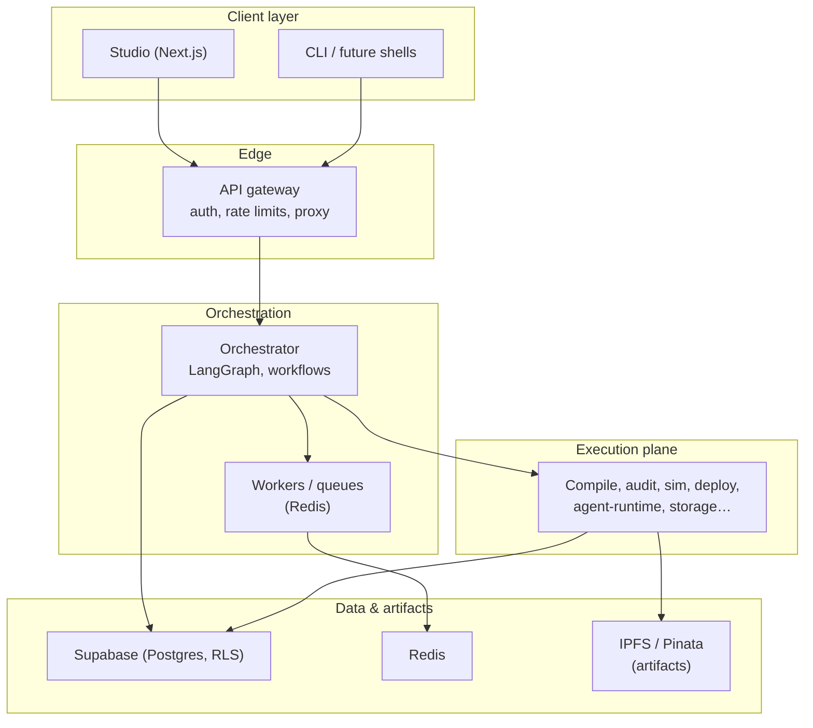

# System context diagram

High-level view of major components and trust boundaries. This is **documentation**, not a deployment diagram for a specific environment.

For vocabulary and file-level mapping, see [architecture map](../agent-operating-model/architecture-map.md).
