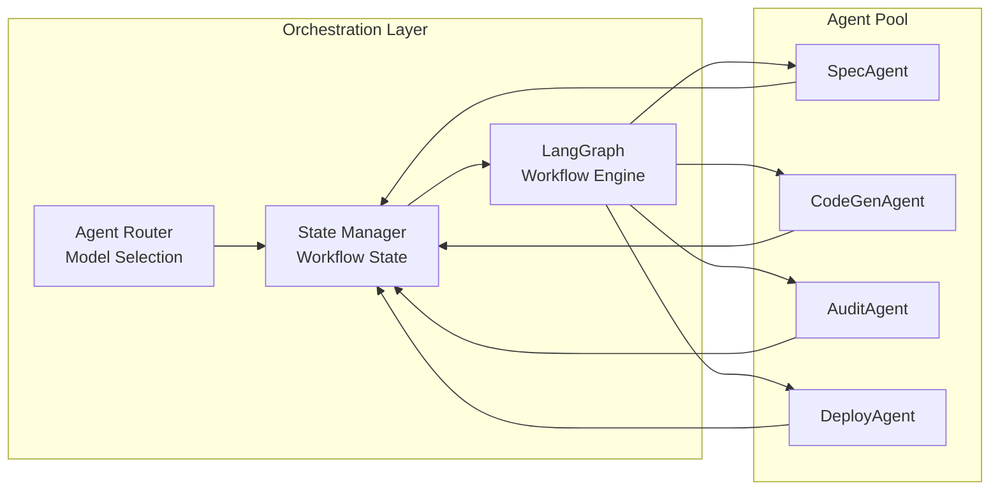

# Issue #180: Implement LangGraph-based orchestrator service

**Status**: Open  
**Assignee**: @JustineDevs  
**Sprint**: Unassigned  
**Milestone**: Phase 1 – Sprint 1 (Feb 5–17)  
**Type**: feature  
**Area**: orchestration  
**GitHub**: https://github.com/Hyperkit-Labs/hyperagent/issues/180  
**Created**: 2026-02-06T08:50:50Z  
**Updated**: 2026-02-06T14:04:14Z

---

## Original Issue Body

## 🎯 Layer 1: Intent Parsing
**What needs to be done?**

**Task Title:**  
> Implement LangGraph-based orchestrator service

**Primary Goal:**  
> Successfully implement langgraph-based orchestrator service with full functionality

**User Story / Context:**  
> As a platform user, I want implement langgraph-based orchestrator service so that the system operates reliably

**Business Impact:**  
> enables core platform functionality

**Task Metadata:**
- Sprint: Sprint 1
- Related Epic/Project: GitHub Project 9 - Phase 1 Foundation
- Issue Type: Feature
- Area: Orchestration

---

## 📚 Layer 2: Knowledge Retrieval
**What information do I need?**

**Required Skills / Knowledge:**
- [ ] Backend/API (FastAPI, Python)
- [ ] DevOps/Infra (CI/CD, Docker)

**Estimated Effort:**  
> M (Medium - 3-5 days)

**Knowledge Resources:**
- [ ] Review `.cursor/skills/` for relevant patterns
- [ ] Check `.cursor/llm/` for implementation examples
- [ ] Read Product spec: `docs/HyperAgent Spec.md`
- [ ] Study tech docs / ADRs in `docs/` directory
- [ ] Review API / schema references for relevant services

**Architecture Context:**
**System Architecture Diagram:**



**Code Examples & Patterns:**
**LangGraph Workflow Example:**
```python
from langgraph.graph import StateGraph, END

workflow = StateGraph(ProjectState)

# Add nodes
workflow.add_node("spec", spec_agent)
workflow.add_node("generate", codegen_agent)
workflow.add_node("audit", audit_agent)

# Define edges
workflow.set_entry_point("spec")
workflow.add_edge("spec", "generate")
workflow.add_conditional_edges(
    "generate",
    should_audit,
    {"audit": "audit", "deploy": "deploy"}
)
workflow.add_edge("audit", "deploy")
workflow.add_edge("deploy", END)

# Compile and run
app = workflow.compile()
result = await app.ainvoke(initial_state)
```

---

## ⚠️ Layer 3: Constraint Analysis
**What constraints and dependencies exist?**

**Known Dependencies:**
- [ ] None identified at this time

**Technical Constraints:**
> Out of scope: Frontend UI changes (track separately)

**Current Blockers:**
> None identified (update as work progresses)

**Risk Assessment & Mitigations:**
> Complex state management; use LangGraph best practices, add comprehensive tests

**Resource Constraints:**
- Deadline: Feb 5–17
- Effort Estimate: M (Medium - 3-5 days)

---

## 💡 Layer 4: Solution Generation
**How should this be implemented?**

**Solution Approach:**
> [Describe the high-level approach here]

**Design Considerations:**
- [ ] Follow established patterns from `.cursor/skills/`
- [ ] Maintain consistency with existing codebase
- [ ] Consider scalability and maintainability
- [ ] Ensure proper error handling
- [ ] Plan for testing and validation

**Acceptance Criteria (Solution Validation):**
- [ ] Implementation complete and tested
- [ ] Code reviewed and approved
- [ ] Documentation updated
- [ ] Unit tests written and passing
- [ ] Integration tests passing
- [ ] Error handling implemented

---

## 📋 Layer 5: Execution Planning
**What are the concrete steps?**

**Implementation Steps:**
1. [ ] Define detailed requirements / confirm acceptance criteria
2. [ ] Implement / build
3. [ ] Write/update tests (unit/integration/e2e as relevant)
4. [ ] Update docs (README, runbook, in-app help, etc.)
5. [ ] Demo in sprint review and gather feedback

**Environment Setup:**
**Repos / Services:**
- Backend repo: `hyperagent/`
- Infra / IaC repo: `hyperagent/infra/`

**Required Environment Variables:**
- `DATABASE_URL=` (get from internal vault)
- `REDIS_URL=` (get from internal vault)
- `ANTHROPIC_API_KEY=` (get from internal vault)
- `OPENAI_API_KEY=` (get from internal vault)
- `GEMINI_API_KEY=` (get from internal vault)

**Access & Credentials:**
- API keys: Internal vault (1Password / Doppler)
- Access request: Contact @devops or project lead

---

## ✅ Layer 6: Output Formatting & Validation
**How do we ensure quality delivery?**

**Ownership & Collaboration:**
- Owner: @JustineDevs
- Reviewer: @ArhonJay
- Access Request: @JustineDevs or @ArhonJay
- Deadline: Feb 5–17
- Communication: Daily stand-up updates, GitHub issue comments

**Quality Gates:**
- [ ] Code follows project style guide
- [ ] All tests pass (unit, integration, e2e)
- [ ] No critical lint/security issues
- [ ] Documentation updated (README, code comments, ADRs)
- [ ] Meets all acceptance criteria

**Review Checklist:**
- [ ] Code review approved by @ArhonJay
- [ ] CI/CD pipeline passes
- [ ] Performance benchmarks met (if applicable)
- [ ] Security scan passes

**Delivery Status:**
- Initial Status: To Do
- Progress Tracking: Use issue comments for updates
- Sign-off: Approved by @Hyperionkit on 2026-02-06
- PR Link: [Link to merged PR(s)]


---

## Implementation Notes

### Progress Updates
- [ ] Started: YYYY-MM-DD
- [ ] In Progress: YYYY-MM-DD
- [ ] Blocked: YYYY-MM-DD (reason)
- [ ] Completed: YYYY-MM-DD

### Implementation Decisions
<!-- Document key decisions made during implementation -->

### Code Changes
<!-- List files created/modified -->
- Files created:
  - 
- Files modified:
  - 

### Testing
- [ ] Unit tests written
- [ ] Integration tests written
- [ ] Manual testing completed

### PR Links
<!-- Link PRs that close this issue -->
- 

### Completion Checklist
- [ ] Code implemented
- [ ] Tests passing
- [ ] Documentation updated
- [ ] PR merged
- [ ] Issue closed

---
*Last synced: 2026-02-06T23:12:26.621451*
