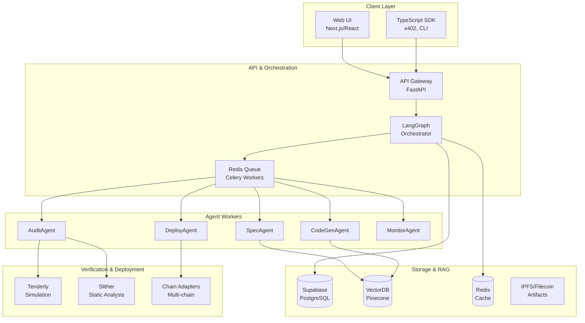

# Issue #201: Epic: BNB chain adapter & Infra preset

**Status**: Open  
**Assignee**: @JustineDevs  
**Sprint**: Unassigned  
**Milestone**: Phase 1 – Sprint 2 (Feb 18–Mar 2)  
**Type**: epic  
**Area**: chain-adapter  
**GitHub**: https://github.com/Hyperkit-Labs/hyperagent/issues/201  
**Created**: 2026-02-06T08:52:47Z  
**Updated**: 2026-02-06T14:03:26Z

---

## Original Issue Body

## 🎯 Layer 1: Intent Parsing
**What needs to be done?**

**Task Title:**  
> Epic: BNB chain adapter & Infra preset

**Primary Goal:**  
> Complete epic: bnb chain adapter & infra preset to enable Phase 1 Foundation goals

**User Story / Context:**  
> As a developer/user, I want epic: bnb chain adapter & infra preset so that HyperAgent functions as designed

**Business Impact:**  
> enables deployment to bnb, supports bnb-infra preset functionality, critical for Phase 1 MVP delivery

**Task Metadata:**
- Sprint: Sprint 2
- Related Epic/Project: GitHub Project 9 - Phase 1 Foundation
- Issue Type: Epic
- Area: Chain-Adapter
- Chain: bnb
- Preset: bnb-infra

---

## 📚 Layer 2: Knowledge Retrieval
**What information do I need?**

**Required Skills / Knowledge:**
- [ ] Smart contracts (Solidity, Foundry/Hardhat)
- [ ] Backend/API (FastAPI, Python)
- [ ] Project Management

**Estimated Effort:**  
> L (Large - multiple sprints)

**Knowledge Resources:**
- [ ] Review `.cursor/skills/` for relevant patterns
- [ ] Check `.cursor/llm/` for implementation examples
- [ ] Read Product spec: `docs/HyperAgent Spec.md`
- [ ] Study tech docs / ADRs in `docs/` directory
- [ ] Review API / schema references for relevant services

**Architecture Context:**
**System Architecture Diagram:**

**Code Examples & Patterns:**
> Review existing codebase for similar implementations

---

## ⚠️ Layer 3: Constraint Analysis
**What constraints and dependencies exist?**

**Known Dependencies:**
- [ ] Chain RPC endpoints must be configured
- [ ] Related bnb-infra preset components

**Technical Constraints:**
> This epic may span multiple sprints; Related issues should be tracked separately; Focus on bnb chain integration; Part of bnb-infra preset implementation

**Current Blockers:**
> None identified (update as work progresses)

**Risk Assessment & Mitigations:**
> Integration risk with external chain APIs; plan spike first, implement feature flags for gradual rollout

**Resource Constraints:**
- Deadline: Feb 18–Mar 2
- Effort Estimate: L (Large - multiple sprints)

---

## 💡 Layer 4: Solution Generation
**How should this be implemented?**

**Solution Approach:**
> [Describe the high-level approach here]

**Design Considerations:**
- [ ] Follow established patterns from `.cursor/skills/`
- [ ] Maintain consistency with existing codebase
- [ ] Consider scalability and maintainability
- [ ] Ensure proper error handling
- [ ] Plan for testing and validation

**Acceptance Criteria (Solution Validation):**
- [ ] All related issues completed
- [ ] Epic goals achieved
- [ ] Integration tested

---

## 📋 Layer 5: Execution Planning
**What are the concrete steps?**

**Implementation Steps:**
1. [ ] Break down epic into smaller issues
2. [ ] Assign issues to team members
3. [ ] Track progress across all related issues
4. [ ] Verify integration of all components

**Environment Setup:**
**Repos / Services:**

**Required Environment Variables:**
- `DATABASE_URL=` (get from internal vault)
- `REDIS_URL=` (get from internal vault)
- `BNB_RPC_URL=` (get from internal vault)

**Access & Credentials:**
- API keys: Internal vault (1Password / Doppler)
- Access request: Contact @devops or project lead

---

## ✅ Layer 6: Output Formatting & Validation
**How do we ensure quality delivery?**

**Ownership & Collaboration:**
- Owner: @JustineDevs
- Reviewer: @ArhonJay
- Access Request: @JustineDevs or @ArhonJay
- Deadline: Feb 18–Mar 2
- Communication: Daily stand-up updates, GitHub issue comments

**Quality Gates:**
- [ ] Code follows project style guide
- [ ] All tests pass (unit, integration, e2e)
- [ ] No critical lint/security issues
- [ ] Documentation updated (README, code comments, ADRs)
- [ ] Meets all acceptance criteria

**Review Checklist:**
- [ ] Code review approved by @ArhonJay
- [ ] CI/CD pipeline passes
- [ ] Performance benchmarks met (if applicable)
- [ ] Security scan passes

**Delivery Status:**
- Initial Status: To Do
- Progress Tracking: Use issue comments for updates
- Sign-off: Approved by @Hyperionkit on 2026-02-06
- PR Link: [Link to merged PR(s)]

---

## Implementation Notes

### Progress Updates
- [ ] Started: YYYY-MM-DD
- [ ] In Progress: YYYY-MM-DD
- [ ] Blocked: YYYY-MM-DD (reason)
- [ ] Completed: YYYY-MM-DD

### Implementation Decisions
<!-- Document key decisions made during implementation -->

### Code Changes
<!-- List files created/modified -->
- Files created:
  - 
- Files modified:
  - 

### Testing
- [ ] Unit tests written
- [ ] Integration tests written
- [ ] Manual testing completed

### PR Links
<!-- Link PRs that close this issue -->
- 

### Completion Checklist
- [ ] Code implemented
- [ ] Tests passing
- [ ] Documentation updated
- [ ] PR merged
- [ ] Issue closed

---
*Last synced: 2026-02-06T23:12:26.624452*
