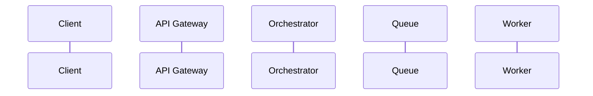
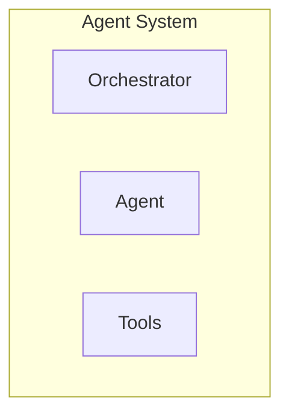

# Architecture Diagrams in Issue Templates

## Overview

Issue templates now include architecture visualization diagrams using Mermaid syntax. Diagrams are automatically generated based on the issue's area, type, and context.

## Diagram Types

### 1. Epic Architecture Diagrams

For epic issues, a high-level system architecture diagram is generated showing:
- Client Layer (UI, SDK)
- API & Orchestration
- Agent Workers
- Storage & RAG
- Verification & Deployment

### 2. Area-Specific Diagrams

Diagrams are contextual based on the issue area:

#### Orchestration
- **FastAPI/API Gateway**: Sequence diagram showing request flow
- **LangGraph/Orchestrator**: Graph showing workflow engine
- **General**: Component diagram of orchestration service

#### Agents
- **SpecAgent**: RAG retrieval and reasoning flow
- **CodeGenAgent**: Model routing between frontier and fast models
- **AuditAgent**: Security analysis tools integration
- **DeployAgent**: Multi-chain deployment flow
- **General**: Agent system architecture

#### Frontend
- Component architecture showing Next.js, React, state management, and API client layers

#### Chain Adapter
- Chain-specific adapter architecture with RPC endpoints and deployment flow

#### Storage/RAG
- Storage layer architecture with Supabase, VectorDB, Redis, and IPFS

#### Infrastructure
- CI/CD pipeline and infrastructure components

#### Observability
- Observability stack with OpenTelemetry, metrics, traces, and visualization

#### Security
- Security layers and tools integration

## Diagram Generation Logic

The `_generate_architecture_diagram()` method:
1. Checks issue type (epics get high-level diagrams)
2. Identifies issue area (orchestration, agents, frontend, etc.)
3. Analyzes title keywords for specific components
4. Generates appropriate Mermaid diagram

## Mermaid Syntax

All diagrams use Mermaid syntax which:
- Renders automatically in GitHub issues
- Supports multiple diagram types (graph, sequence, flowchart)
- Is human-readable and editable
- Can be viewed in Mermaid Live Editor

## Examples

### Orchestration Diagram

### Agent Architecture

## Customization

To add or modify diagrams:
1. Edit `_generate_architecture_diagram()` method
2. Add new area-specific methods (e.g., `_generate_custom_diagram()`)
3. Update title keyword matching for specific components
4. Follow Mermaid syntax best practices

## Benefits

1. **Visual Context**: Developers immediately see system architecture
2. **Better Understanding**: Diagrams clarify component relationships
3. **Implementation Guidance**: Shows where code fits in the system
4. **Documentation**: Diagrams serve as living architecture docs
5. **Onboarding**: New team members understand system structure faster

## Integration

Diagrams are inserted in the issue template at:
- **Section 5.1**: Architecture Visualization (after Context & Resources)
- Before Implementation Guide (Section 5.2)

This placement ensures developers see the architecture before diving into code examples.

## Future Enhancements

Potential improvements:
- Interactive diagrams with clickable components
- Sequence diagrams for specific workflows
- Database schema diagrams for storage issues
- Network topology for infrastructure issues
- Security flow diagrams for security issues

